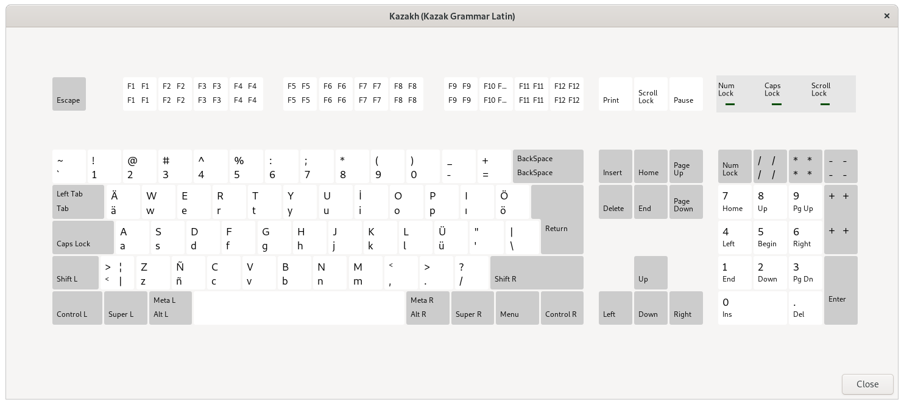

# kazak-grammar-X11-keyboard-layout




## Install

`install.sh` copies data from current folder into `/usr/share/X11/xkb/`.
```shell script
sudo ./install.sh
```

## Check

You can check whether it's installed or not using: 
```shell script
localectl list-x11-keymap-variants kz
```

and it should yield you
```
ext
kazakgrammar
kazrus
latin
ruskaz
```

## Usage

If you use consistent DE, then you can probably choose the proper variant in your keyboard settings.

Otherwise you can set your keyboard layout via: 
```shell script
setxkbmap -layout kz -variant kazakgrammar
```

In my case I use it like:
```shell script
setxkbmap -option 'grp:alt_shift_toggle' -layout us,kz -variant ,kazakgrammar
```
